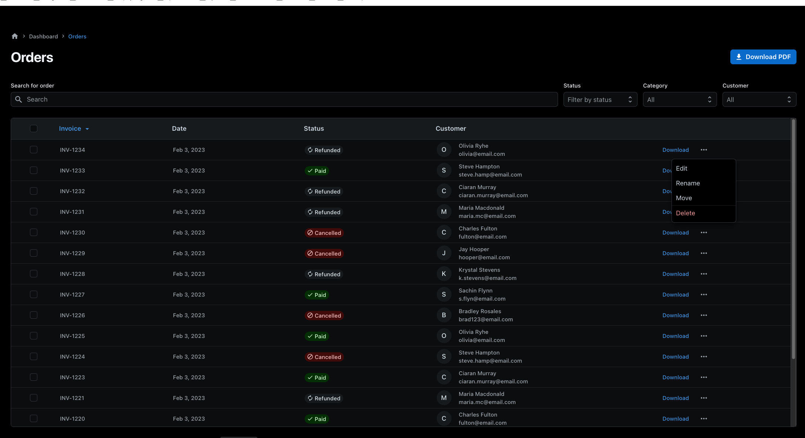
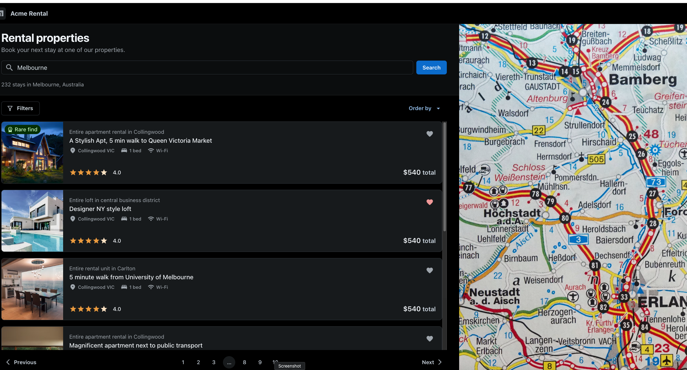
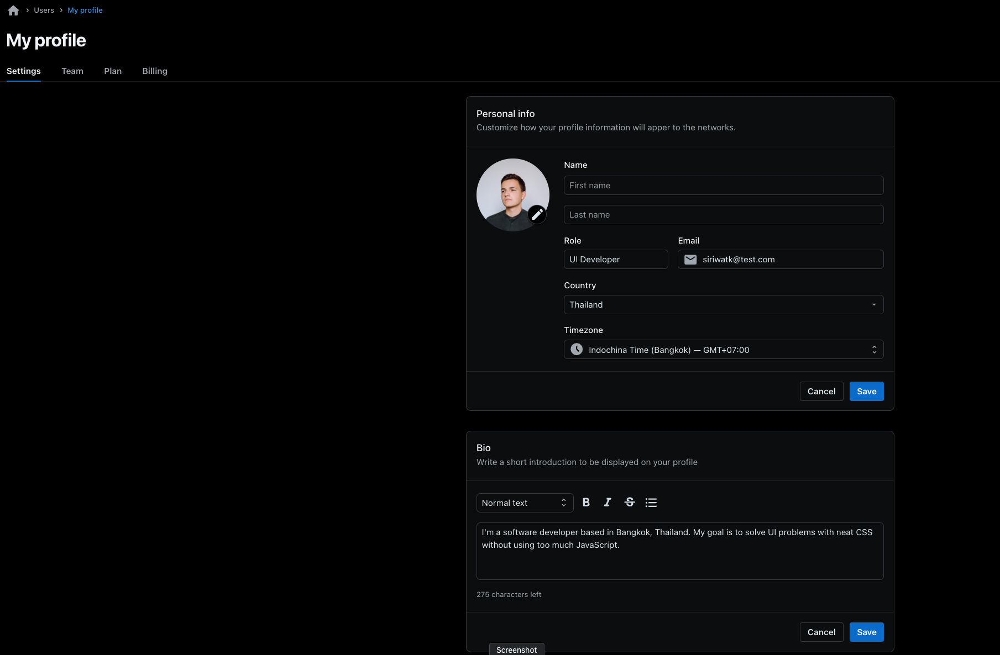
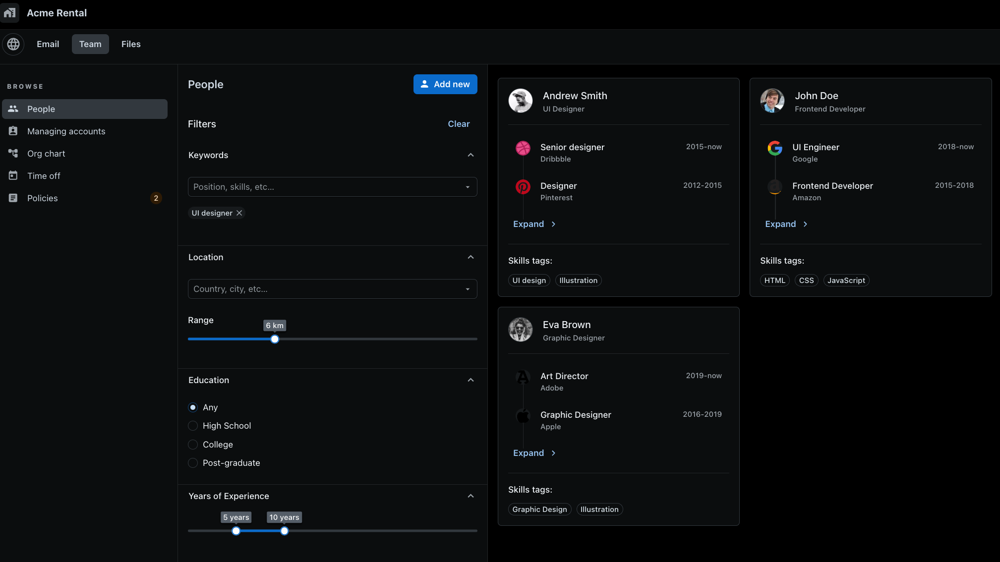
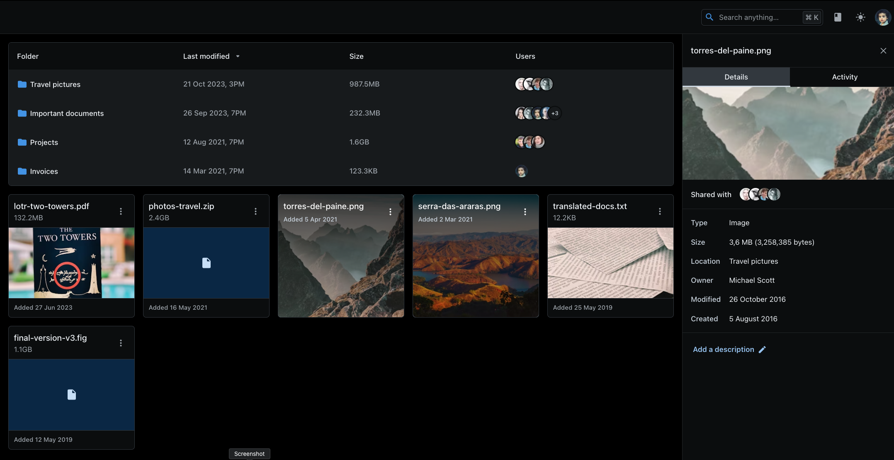
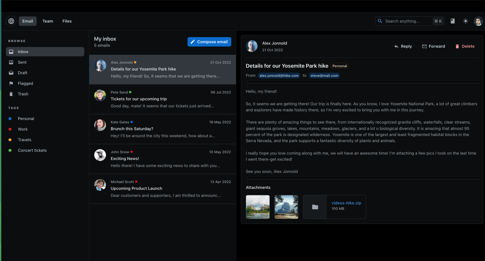
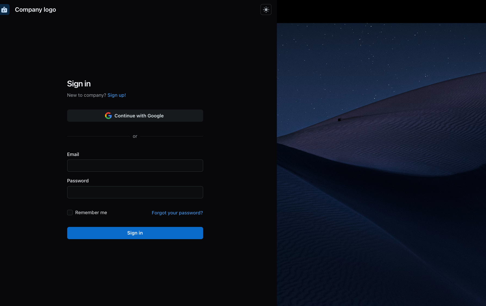

# [Joy UI templates](https://mui.com/joy-ui/getting-started/templates/)

- Installation: `npm install @mui/joy @emotion/react @emotion/styled`
- All templates are displayed in the same page `npm run dev`

## Order Dashboard

- 

## Rental Dashboard (could be improved with openstreet map API)

- 

## Profile

- 

## Team View

- 

## Files View

- 

## Emails View

- 

## Login View

- 

## Messages View

- 
